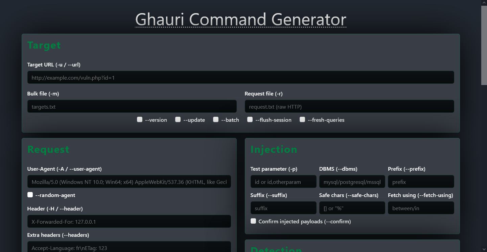

# ⚡ Ghauri Command Generator (Web UI)

A modern, web-based **command generator** for [Ghauri](https://github.com/r0oth3x49/ghauri).  
Easily build and copy complex Ghauri SQL injection commands without memorizing every flag.  

---
## 📷 Screenshots

---

## ✨ Features

- 🎯 **Target Setup**  
  - URL, bulk file, or raw request file support  
  - Quick options: `--version`, `--update`, `--batch`, etc.  

- 📡 **Request Options**  
  - Custom **User-Agent**, headers, cookies, referer, host, and proxy  
  - Random User-Agent toggle  
  - Delay, timeout, retries, and SSL options  

- ⚙️ **Optimization**  
  - Control thread count (`--threads`)  

- 🛠️ **Injection Settings**  
  - Select parameters (`-p`), DBMS, prefix, suffix  
  - Safe characters and fetch modes  

- 🔍 **Detection Controls**  
  - Verbosity & Level  
  - Match/Not-Match strings or HTTP codes  
  - Text-only comparison  

- 📑 **Enumeration**  
  - Database info (`--banner`, `--current-db`, `--dbs`, etc.)  
  - Dump tables, columns, or full database  
  - SQL shell access  
  - Specify database, table, and columns  

- 🧪 **Techniques**  
  - Boolean (B), Error (E), Union (U), Stacked (S), Time-based (T), Inline (Q)  
  - Time delay configuration  

- 🚀 **Advanced Options**  
  - Test filter  
  - Custom flags/tamper scripts  

- 🖥️ **Output & Utility**  
  - Command preview box  
  - **Generate** and **Reset** buttons  
  - One-click **Copy Command** button  

---

